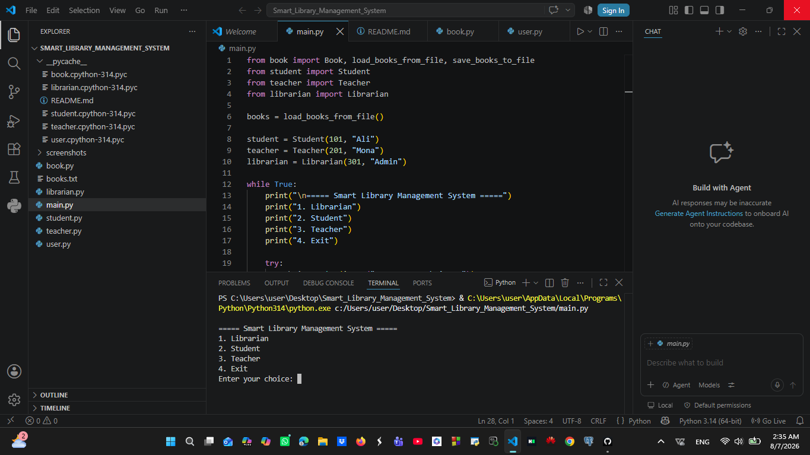

# 📚 Smart Library Management System

> A console-based library management system built with **Python**, implementing core **Object-Oriented Programming (OOP)** principles, role-based access, and robust file persistence.

---

## 🌟 Overview
This project simulates a fully functional library system with distinct roles for **Librarians**, **Teachers**, and **Students**. It handles book inventories, borrowing rules, and error handling seamlessly while keeping data safe across sessions using text files.

---

## 🛠️ OOP Principles Applied
- **Inheritance:** `Student`, `Teacher`, and `Librarian` inherit from a central abstract `User` class.
- **Encapsulation:** Managing and protecting object attributes properly.
- **Polymorphism:** Overriding role-specific methods and behaviors.
- **Abstraction:** Enforcing structure using Python's `abc` module.

---

## 🚀 Features
- **Role-Based Menus:** Tailored options and permissions for different users.
- **Book Operations:** Add, remove, search, and view all, available, or borrowed books.
- **Borrowing & Returning System:** Enforces role-specific borrowing limits and checks.
- **Data Persistence (Bonus):** Automatically saves and loads library data using text files (`books.txt`).
- **Exception Handling:** Bulletproof input validation to prevent crashes on invalid entries.

---

## 💻 How to Run
1. Make sure Python is installed on your machine.
2. Clone or download the project files into a single directory.
3. Open your terminal or VS Code in that directory and run:
   ```bash
   python main.py
   ---
## 📸 Program Screenshots

